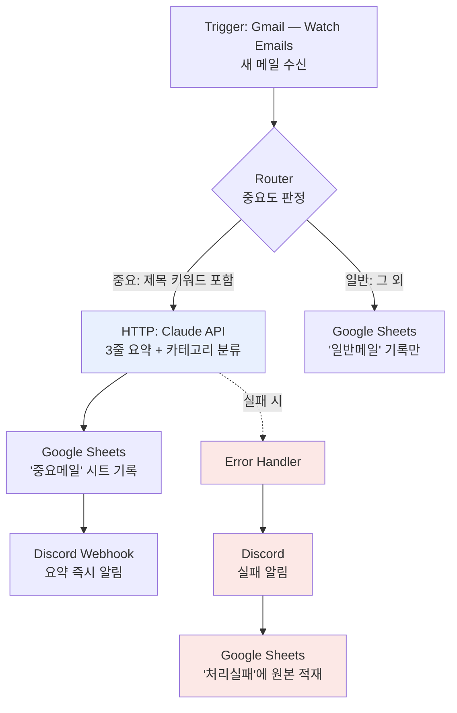

# B1-3 「노코드 자동화 기초: 워크플로우 설계」 — 모범답안

> 미션 요구사항(공통·프로젝트1·프로젝트2·보너스1·2·제약)을 **모두 충족**하도록 구성한 참고 모범답안.
> 채점 관점: "돌아가기만 하면 된다"가 아니라 **Trigger/Action 원리 이해 · 조건분기 설계 · 근거 있는 도구 비교**가 핵심.
> 모든 민감정보(API Key/토큰/이메일)는 `***` 마스킹 전제로 작성했다.

---

## 0. 요구사항 충족 매핑 (셀프 체크)

| 요구사항 | 충족 위치 | 상태 |
|---|---|---|
| 실제 동작하는 워크플로우 | P1·P2 모두 실행 이력 캡처 | ✅ |
| Trigger 1개 이상 | P1: Sheets 새 행 / P2: Gmail 새 메일 | ✅ |
| Action 2개 이상 | P1: Gmail+Sheets / P2: Claude요약+Sheets+Discord | ✅ |
| 조건 분기 1개 이상 | P1: Router(참석/미참석) / P2: Router(중요/일반) | ✅ |
| 분기별 1회 이상 실행 확인 | P1 각 경로 2회 실행 이력 | ✅ |
| P1: 도구 2개 이상 | Make + Zapier (＋n8n 무료대안 분석) | ✅ |
| P1: 동일 구조 구현 | 동일 시나리오를 양 도구에 구현 | ✅ |
| P1: 비교항목 5개 이상 | 7개 항목 비교 | ✅ |
| P2: 반복업무 정의 + 도구선정 근거 | 메일 분류·요약, Make 선정 | ✅ |
| P2: Trigger 발생 시 자동 실행 | Gmail 폴링 트리거 상시 대기 | ✅ |
| 보너스1: AI 연동 Action | Claude API로 요약·분류 | ✅ |
| 보너스2: 실패 알림·재시도 | Error handler → 재시도+알림+원본적재 | ✅ |
| 보안: 민감정보 마스킹 | 전 캡처 마스킹, 키는 Connections 저장 | ✅ |

---

# [프로젝트 1] 자동화 도구 비교 구현 — Make vs Zapier

## 1. 업무 시나리오

**행사 참석 여부 응답을 수집해, 참석/미참석에 따라 다른 안내 메일을 자동 발송하고 명단을 분리 관리한다.**

동일한 구조를 Make와 Zapier에 각각 구현했다.

```
[Trigger]  Google Sheets — 응답 시트에 새 행 추가
    │
[분기]     참석 여부 판정 (Router / Filter)
    │
    ├── 참석 확정 ─→ [Action 1] Gmail 참석 안내 메일
    │                [Action 2] '참석자' 시트에 기록
    │
    └── 미참석   ─→ [Action 1] Gmail 미참석 확인 메일
                     [Action 2] '미참석자' 시트에 기록
```

## 2. 구현 요약

### Make
| 단계 | 모듈 | 설정 |
|---|---|---|
| Trigger | Google Sheets — Watch New Rows | 응답 시트, 헤더 인식 On, 15분 폴링 |
| 분기 | **Router** + 경로별 Filter | 1st `참석여부 = 참석` / 2nd `= 미참석` |
| Action 1 | Gmail — Send an email | 경로별 안내 문구 (Body type=HTML 지정) |
| Action 2 | Google Sheets — Add a Row | `참석자` / `미참석자` 시트 |

- 단일 시나리오 안에서 양방향 분기 완결. 양쪽 경로 각 **2회** 실행 확인.

### Zapier
| 단계 | 모듈 | 설정 |
|---|---|---|
| Trigger | Google Sheets — New Spreadsheet Row | 응답 시트 |
| 분기 | **Filter by Zapier** | Zap A `참석` / Zap B `미참석` |
| Action 1 | Gmail — Send Email | Make와 동일 문구 |
| Action 2 | Google Sheets — Create Spreadsheet Row | `참석자` / `미참석자` 시트 |

- Zapier는 Zap 단위 구조라 **경로마다 Zap을 분리**(A/B 2개)해 구현.

### ⚠️ 유료 기능 사용 사유 (제약사항 대응)
Zapier Free는 **2단계(Trigger + Action 1개)만** 지원한다. 본 과제는 *Action 2개 + 분기 1개 = 최소 4단계*라 무료로는 **구조적으로 불가능**하다. 따라서 결제정보가 필요 없는 **Professional 14일 체험**을 사용했다.
**무료 대안:** 동일 구조를 **Make 단독**(무료 범위 내 완결) 또는 **n8n**(오픈소스·자가호스팅 시 실행량 무제한)으로 구현 가능하다. → **이 차이 자체가 두 도구의 가장 실질적인 구분점이다.**

## 3. 비교 분석 (7개 항목)

| # | 항목 | Make | Zapier |
|---|---|---|---|
| ① | UI/UX | 2차원 캔버스에 노드 배치·연결, 분기가 선으로 보임 | 위→아래 단계 리스트, 분기는 들여쓰기 |
| ② | 설정 난이도 (첫 성공까지) | 약 **25분** — `{{1.필드}}` 변수 참조 학습 곡선 | 약 **12분** — 드롭다운 위주로 진입 쉬움 |
| ③ | **조건 분기** ★ | Router 1개로 단일 시나리오 내 다중 분기 | Zap 2개로 분리 → 공통 로직 **2곳** 수정 |
| ④ | 무료 플랜 범위 | 1,000 ops/월, 깊이 제한 없음, Router 포함 | 100 tasks/월, **2단계 제한**(분기 실질 불가) |
| ⑤ | 연동 서비스 범위 | 앱 3,000+, **HTTP 모듈 무료** | 앱 8,000+, **Webhooks는 유료** |
| ⑥ | 실행 로그/디버깅 | History에서 모듈별 입·출력 전체 확인, 재실행 용이 | Task History, 단계별 데이터, Zap Replay |
| ⑦ | 실행 속도/반응성 | 무료 최소 15분 폴링, Run once로 즉시 테스트 | 폴링 주기 플랜별 상이, 편집화면 테스트 |

**③ 핵심 소감:** 안내 문구 하나를 바꿔도 Zapier는 두 Zap을 각각 열어 동일 수정을 반복해야 했고, **한쪽만 고치는 실수**가 나기 쉬웠다. Make는 Router 이전 단계를 한 번 고치면 양쪽에 일괄 반영됐다. 분기가 늘수록 이 차이는 커진다.

## 4. 장단점

**Make** — 👍 무료만으로 Router·Filter·HTTP 완결 / 시각적 흐름 파악 / 로그 상세.  👎 변수 문법 학습 곡선 / 무료 15분 간격 / 활성 시나리오 2개 제한.
**Zapier** — 👍 진입 쉬움 / 앱 수 최다 / 단순 워크플로우는 읽기 쉬움.  👎 무료 2단계 제한 / 분기마다 Zap 분리 → 유지보수 비용 / Webhooks 유료.

## 5. 어떤 상황에서 무엇을 고를 것인가

| 상황 | 선택 | 근거 |
|---|---|---|
| 개인 학습 / 비용 0원 | **Make** | 무료로 분기 포함 워크플로우 완결 |
| 분기 많은 복잡한 자동화 | **Make** | Router 단일 시나리오 관리 |
| Trigger→Action 1개 단순 연결 | **Zapier** | 설정 빠름, 무료로 충분 |
| 희귀 SaaS 연동 | **Zapier** | 커넥터 수 우위 |
| 데이터 외부 반출 곤란 | **n8n** | 자가호스팅으로 데이터 통제 |

**종합:** "무엇이 더 좋다"가 아니라 **"비용·분기 복잡도·데이터 통제 요건"의 세 축으로 고른다.** 학습·개인용은 Make, 단순 연결·희귀 커넥터는 Zapier, 데이터 주권이 중요하면 n8n.

## 6. 겪은 문제와 해결

| 문제 | 도구 | 해결 |
|---|---|---|
| Gmail 저장 시 `Body type: Value must not be empty` | Make | 본문 형식이 필수인데 비어 있었음 → Text/HTML 지정 후 해결. 오류가 모듈·필드를 정확히 짚어 원인 파악이 빨랐다 |
| Sheets 트리거가 헤더를 필드로 오인 | Make | "Table contains headers = Yes" 설정으로 해결 |
| 두 Zap의 문구 불일치 | Zapier | 공통 문구를 별도 메모로 관리해 양쪽 동기화 (분리 구조의 취약점 체감) |

---

# [프로젝트 2] 자유 주제 자동화 — 메일 자동 분류·AI 요약·실패대응 파이프라인 (Make)

> 보너스 1(AI 연동)·2(실패 알림·재시도)를 **모두 포함**하는 설계.

## 1. 반복 업무 정의

받은편지함의 업무 메일을 읽고 핵심을 파악해 관리 시트에 옮기고 필요 시 팀에 공유하는 작업.

| 항목 | 값 |
|---|---|
| 발생 빈도 | 하루 약 15회 |
| 1회 소요 | 약 3분 |
| 일일 누적 | 약 45분 |
| 월 환산 | 약 15시간 |

**자동화 적합 판단 근거:** ① 트리거 명확(메일 수신) ② 판단 규칙화 가능(발신자·키워드) ③ 결과물 형태 일정(같은 시트) ④ 반복 빈도 높아 구축비 회수 가능.

## 2. 도구 선정: Make

| 기준 | 판단 |
|---|---|
| 비용 | 무료 플랜에서 Router·HTTP·Error handler 모두 제공 |
| 분기 | Router로 단일 시나리오 다중 분기 |
| AI 연동 | HTTP 모듈로 Claude API 직접 호출(전용 커넥터 불필요) |
| 오류 처리 | **Error handler**를 모듈 단위 설계 → 보너스 2 필수 |
| 재사용 | P1의 Google 연동 그대로 활용 |

**탈락:** Zapier(무료 2단계 제한·체험 만료 후 지속 불가), n8n(24시간 서버 상시 가동 부담).

## 3. 워크플로우 설계



| # | 단계 | 유형 | 설명 |
|---|---|---|---|
| 1 | Gmail — Watch Emails | Trigger | 새 메일 도착 시 시작 |
| 2 | Router | 분기 | 제목/발신자로 중요/일반 분리 |
| 3 | HTTP — Claude API | Action(AI) | 본문 3줄 요약 + 카테고리 분류 |
| 4 | Sheets — Add a Row | Action | 요약 결과 축적 |
| 5 | Discord Webhook | Action | 요약 즉시 알림 |
| E | Error Handler | 예외 | AI 실패 시 알림 + 원본 보존 |

## 4. 분기 조건 상세

| 경로 | 조건 | 처리 |
|---|---|---|
| 중요 | 제목에 `계약/긴급/승인/마감` 포함 **또는** 지정 도메인 발신자 | AI 요약 → 시트 → 즉시 알림 |
| 일반 | 그 외 전부 | 시트 기록만 |

**설계 의도:** 모든 메일에 알림을 보내면 알림이 소음이 된다. AI 호출은 비용이 드므로 **중요 메일에만 선택 적용**해 비용·주의력을 배분한다 — 이것이 조건 분기의 실질 역할이다.

## 5. Claude API 연동 (보너스 1)

HTTP — Make a request 설정:

| 항목 | 값 |
|---|---|
| URL | `https://api.anthropic.com/v1/messages` |
| Method | POST |
| Headers | `x-api-key: ***` · `anthropic-version: 2023-06-01` · `content-type: application/json` |
| Body | Raw(JSON) |

```json
{
  "model": "claude-sonnet-5",
  "max_tokens": 500,
  "messages": [{
    "role": "user",
    "content": "다음 이메일을 처리해줘.\n1) 핵심 3줄 요약\n2) 카테고리: [계약/문의/공지/기타] 중 하나\n3) 대응필요: [필요/불필요]\n형식:\n요약:\n- \n카테고리: \n대응필요: \n---\n제목: {{1.subject}}\n본문: {{1.text}}"
  }]
}
```

- 응답 추출: `{{5.data.content[1].text}}` — **Make 표현식 인덱스는 1부터.** `[0]`으로 고치면 값이 안 나온다. `content`는 블록 배열이라 응답 형태가 바뀌면 조용히 빈 값이 될 수 있으니, 요약이 공란이면 여기를 먼저 의심.
- **보안:** 키는 Make **Connections/변수**에 저장, 모듈 직접입력·캡처 노출 금지(`sk-ant-***` 마스킹).

## 6. 실패 알림·재시도 (보너스 2)

AI API 호출은 네트워크·레이트리밋·지연으로 **실패 가능한 지점**이다. 예외 처리가 없으면 시나리오가 중단되고 그 메일은 **어디에도 기록되지 않은 채 유실**된다. 자동화의 신뢰성은 "실패했을 때 무슨 일이 일어나는가"로 결정된다.

| 전략 | 구현 | 목적 |
|---|---|---|
| 1차 재시도 | Error handler에 **Break** — 3회 / 15분 간격 | 일시 오류·레이트리밋 자동 복구 |
| 2차 실패 알림 | Discord 웹훅(제목+오류메시지) | 사람이 인지 |
| 3차 대체 경로 | `처리실패` 시트에 **원본 전문** 적재 | 요약 실패해도 데이터 보존 |

**검증:** 키를 일부러 틀린 값으로 → 실행 → Discord 실패 알림 수신 + `처리실패` 시트 원본 적재 확인 → 키 원복. (캡처: `captures/make/05-실패알림.png`)

## 7. 구현 결과 (예시 수치)

| 항목 | 값 |
|---|---|
| 총 실행 | 24회 (경로1 9 / 경로2 15) |
| 실패 처리 테스트 | 2회 |
| 1건당: 자동화 전 → 후 | 3분 → 약 20초(무인) |
| 월 절감 | 약 15시간 |

## 8. 한계 및 배운 점

- **15분 폴링** — 실시간이 필요하면 Gmail Push(Pub/Sub) 기반 Webhook 트리거로 전환.
- **키워드 분기** — 오분류 가능. 분류를 AI에 맡기면 정확도↑·비용↑ (정확도-비용 트레이드오프).
- **월 1,000 ops** — 수신량 많으면 초과.

**배운 점:** Trigger는 "언제 시작할지"를, Action은 "무엇을 할지"를 정의한다. 조건 분기는 갈래를 나누는 것을 넘어 **유한한 자원(비용·주의력)을 배분**하는 장치다. 그리고 자동화 설계에서 가장 중요한 건 "돌아가게 만드는 것"이 아니라 **"실패해도 데이터를 잃지 않게 만드는 것"**이었다.

---

## 첨부 캡처 목록 (전부 마스킹)

P1: `make/01-전체시나리오` `make/02-실행이력` `make/03-필터설정` `zapier/00-플랜확인` `zapier/01-zapA` `zapier/02-zapB` `zapier/03-task-history` `sheets/01-결과시트`
P2: `make/04-프로젝트2-시나리오` `make/05-실패알림` `make/06-실행이력` `sheets/02-요약결과` `discord/02-요약알림`
